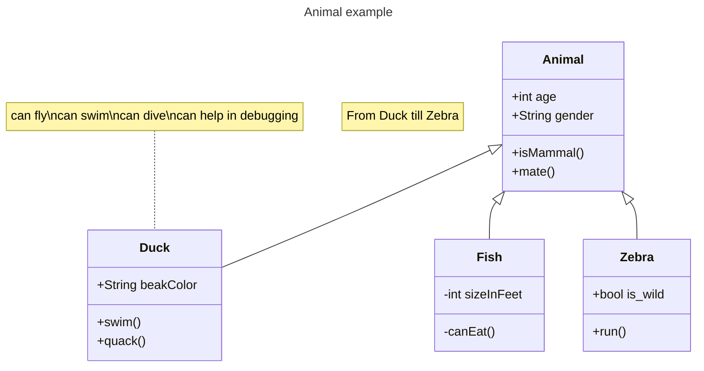

# What is SysML? 

* SysML stands for Systems Modeling Language.  
* It's a graphical modeling language that supports systems engineering.  
* It defines the kinds of elements you're allowed to put in your model and the allowable relationships between them.  
* It is an *enabler* of [Model-Based Systems Engineering](../202110052023)
* It closes the communications gap between systems and software engineers.  
* [4 Pillars of SysML](../202310270518)  
* [9 Diagrams of SysML](../202403090209)  

## Example

## References
*SysML Distilled* by Lenny Delligatti

## Tags
#systems #MBSE
