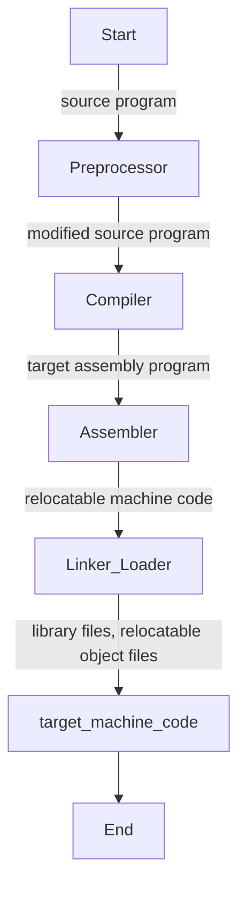

# Typical Language Processing System


```
Start
|  
v  
[source program]  
|  
v  
[Preprocessor]  
|  
v  
[modified source program]  
|  
v  
[Compiler]  
|  
v  
[target assembly program]  
|  
v  
[Assembler]  
|  
v  
[relocatable machine code]  
|  
v  
[Linker/Loader] --> [library files, relocatable object files]  
|  
v  
[target machine code] --> End  
```

## Tags
#programming #software
