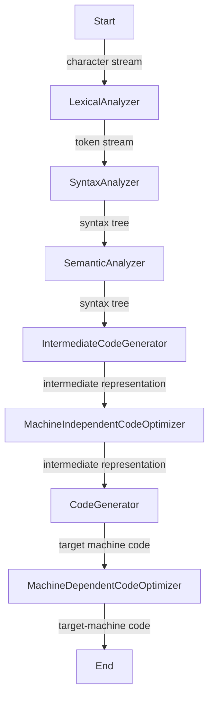

# Phases of a Compiler

The first two steps are lexical analysis and syntax analysis, and look something like this:  

## Links
[LexicalAnalyzer](../202402060541)

## References
[1] *Compilers Principles, Techniques, and Tools; 2nd Edition* by Aho
[2] [What is a Compiler?](../202402060504)

## Tags
#cs
