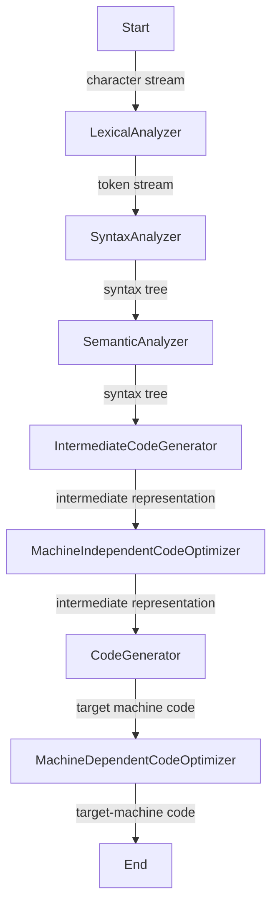

# Phases of a Compiler

A compiler takes in an input stream of text and produces target machine code.  

The first two steps are lexical analysis and syntax analysis. By the end you've got an abstract syntax tree. The process looks something like this:  

By the end of the whole compilation process, you (usually) end up with machine code. It looks something like this:  

## Links
[LexicalAnalyzer](../202402060541)

## References
[1] *Compilers Principles, Techniques, and Tools; 2nd Edition* by Aho  
[2] [What is a Compiler?](../202402060504)

## Tags
#cs
