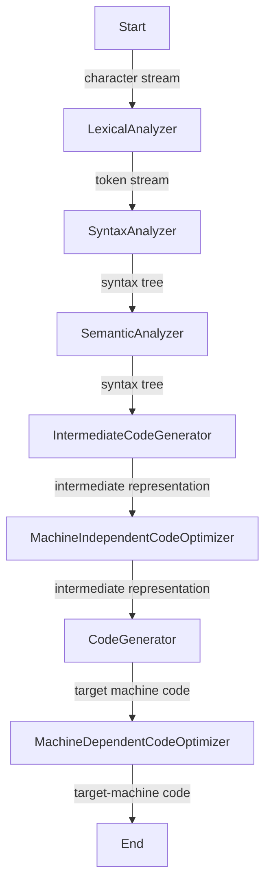

# Phases of a Compiler

```mermaid
graph TD;
  Start -->|character stream| LexicalAnalyzer-->|token stream| SyntaxAnalyzer-->|syntax tree| SemanticAnalyzer-->|syntax tree| IntermediateCodeGenerator-->|intermediate representation| MachineIndependentCodeOptimizer -->|intermediate representation| CodeGenerator -->|target machine code| MachineDependentCodeOptimizer --> |target-machine code| End;

```

## Links
[LexicalAnalyzer](../202402060541)

## References
*Compilers Principles, Techniques, and Tools; 2nd Edition* by Aho

## Tags
#programming #software
