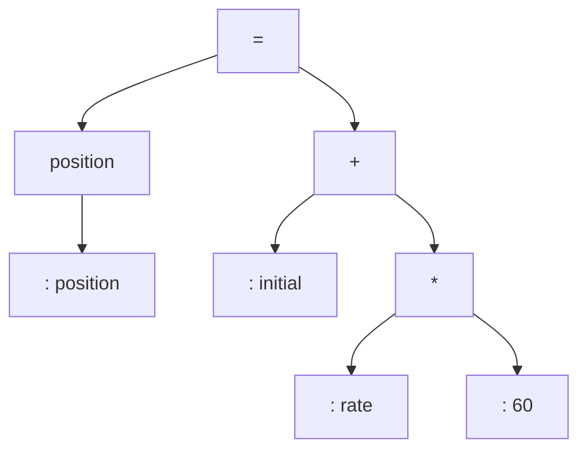

# Syntax Analysis

The second phase of the compiler is *syntax analysis* or *parsing*. The parser uses the tokens to create a tree-like intermediate representation that depicts the grammatical structure of the token stream; typically referred to as a syntax tree.

## References
[1] *Compilers Principles, Techniques, and Tools; 2nd Edition* by Aho
[2] [Phases of a Compiler](../202402060533)

## Tags
#programming
